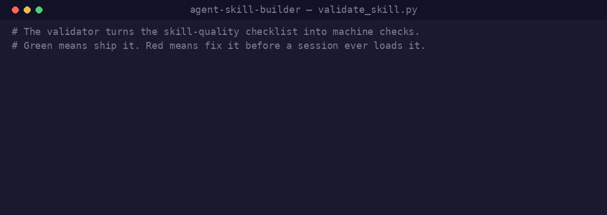

# agent-skill-builder

A skill that builds agent skills — and doesn't rot.

<p align="center">
  
</p>

Most skill generators fail the same three ways: they don't know the current frontmatter spec (`arguments`, `argument-hint`), they never suggest `disable-model-invocation`, and they write bloated descriptions that tax every session's context. This one treats those as the design decisions, and it's built to stay current: the spec knowledge lives in a pinned, dated snapshot that CI re-checks against the live docs weekly.

## What it does

Describe the skill you want in plain language. It walks the decisions that separate a good skill from a prompt pasted into a folder:

- **Invocation control** — who triggers it? User-only workflows get `disable-model-invocation: true` (which also costs zero ambient context). Background knowledge gets `user-invocable: false`. Both-ways skills must earn their permanent description cost.
- **Arguments** — `argument-hint` plus `$ARGUMENTS`/`$N`/named args, wired into the body.
- **Context budget** — triggers in the description (~250 chars), detail in the body, which loads only on invocation.
- **Tool grants, execution context, dynamic injection** — `allowed-tools` scoped tight (it's a pre-approval grant, not a sandbox), `context: fork` for isolated tasks, `` !`command` `` for live data.

Then it validates the result mechanically and tells you how to test it in a fresh session.

Three modes:

```
/agent-skill-builder new <description of the skill you want>
/agent-skill-builder review path/to/SKILL.md
/agent-skill-builder migrate path/to/legacy-command.md
```

## Install

```bash
mkdir -p your-project/.claude/skills
cp -r agent-skill-builder your-project/.claude/skills/agent-skill-builder
```

That's the whole installation for Claude Code — the directory name becomes the command. Use `~/.claude/skills/` to make it available across all your projects. The core follows the [Agent Skills](https://agentskills.io) standard, so other compatible tools can load it too.

## The validator

`scripts/validate_skill.py` turns the quality checklist into machine checks — run it against any skill directory:

```bash
python3 scripts/validate_skill.py path/to/skill-dir
```

It checks: frontmatter parses, unknown keys, description budget (~250 target, 1,536 listing cap), `$ARGUMENTS`/`argument-hint` pairing, unscoped `Bash` grants, side-effect commands on model-invocable skills, `context: fork` bodies with no task, broken relative links, oversized bodies, leftover placeholders, credentials. Output is `PASS`/`FAIL` plus warnings; exit code is CI-friendly.

## Staying current (the anti-rot design)

[references/claude-code-frontmatter.md](references/claude-code-frontmatter.md) is a dated snapshot of the Claude Code skill spec. The skill **never mutates it mid-generation** — if it's stale, you get a warning and the pinned version. Instead, the [`spec-drift` workflow](.github/workflows/spec-drift.yml) checks the live docs weekly and opens an issue when fields change or the snapshot ages past 90 days, so updates happen as reviewed PRs. Generation stays deterministic; maintenance stays visible.

## Relationship to other tools

- [claude-code-skills](https://github.com/conorbronsdon/claude-code-skills) — my collection of production skills; this repo is the extracted, hardened home of its `skill-creator`, and the collection's copy tracks this one.
- Anthropic's official [`skill-creator` plugin](https://github.com/anthropics/claude-plugins-official/tree/main/plugins/skill-creator) evaluates skill *output quality* (evals, benchmarks, description tuning). This repo designs and validates skill *structure*. They compose — build here, then eval there.

## Author

Authored by [Conor Bronsdon](https://github.com/conorbronsdon) · [LinkedIn](https://www.linkedin.com/in/conorbronsdon/) · [Chain of Thought podcast](https://chainofthought.show)

## License

MIT
