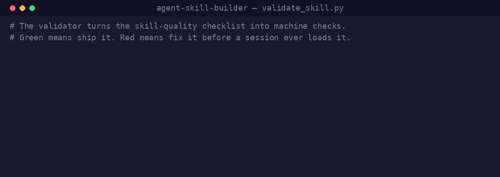

<div align="center">

# agent-skill-builder

A Claude Code-first skill builder with portable Agent Skills validation and drift detection that can fail.

[](https://github.com/conorbronsdon/agent-skill-builder/stargazers)
[](LICENSE)
[](https://chainofthought.show/?utm_source=github&utm_medium=referral&utm_campaign=repo-readme&utm_content=agent-skill-builder)
[](https://x.com/ConorBronsdon)



</div>

---

Skill generators age fast. Frontmatter changes, runtime-specific fields leak into portable skills, and structural validators pass because nobody tested whether they can fail.

`agent-skill-builder` handles those as explicit design decisions. It builds Claude Code skills by default, can target the portable [Agent Skills](https://agentskills.io) core, validates each runtime separately, and checks the live Claude Code field set every week.

## What it does

Describe the skill you want in plain language. The builder decides:

- **Runtime**: Claude Code extensions or the portable Agent Skills core.
- **Skill shape**: reference, bounded task, or tool-backed workflow.
- **Invocation control**: user-only, model-only, or discoverable both ways.
- **Arguments**: `$ARGUMENTS`, positional `$N`, or named arguments wired into the body.
- **Context budget**: trigger language in the description, conditional detail in references.
- **Execution safety**: scoped tool grants, explicit mutation gates, and read-only dynamic injection.

Three modes cover the lifecycle:

```text
/agent-skill-builder new <description of the skill you want>
/agent-skill-builder review path/to/SKILL.md
/agent-skill-builder migrate path/to/legacy-command.md
```

## Install

```bash
mkdir -p your-project/.claude/skills
cp -r agent-skill-builder your-project/.claude/skills/agent-skill-builder
```

Use `~/.claude/skills/` instead to make it available across projects. The builder itself uses Claude Code extensions; skills it generates in portable mode stay within the Agent Skills core.

## Runtime-aware validation

The validator has two profiles:

```bash
python3 scripts/validate_skill.py --profile claude-code path/to/skill-dir
python3 scripts/validate_skill.py --profile agentskills path/to/skill-dir
```

The Claude Code profile understands invocation controls, arguments, forked contexts, current boolean aliases, dynamic injection, and the 1,536-character listing cap. The portable profile enforces required `name` and `description` fields, name-directory matching, portable fields, and the 1,024-character description cap.

For portable releases, also run the upstream validator when available:

```bash
skills-ref validate path/to/skill-dir
```

Both profiles check broken links, unscoped tool grants, argument wiring, duplicate frontmatter keys, unsafe dynamic commands, oversized bodies, scaffold placeholders, and credential-shaped strings. Output is `PASS` or `FAIL` with CI-friendly exit codes.

## Tests that prove the checks can fail

The test suite includes paired valid and invalid cases rather than validating only bundled examples:

```bash
python3 -m unittest discover -s tests -v
```

Coverage includes both runtime profiles, added and removed spec fields, network failures, boolean aliases, named arguments, gated and ungated mutations, dynamic command injection, links, duplicate keys, and credential detection.

## Staying current

[references/claude-code-frontmatter.md](references/claude-code-frontmatter.md) is a dated snapshot used during deterministic generation. The [`spec-drift` workflow](.github/workflows/spec-drift.yml) fetches the official Markdown source weekly and compares the complete frontmatter field set in both directions. Added fields, removed fields, stale snapshots, fetch failures, and parser failures all require maintainer review.

Field equality does not prove semantic equality. The 90-day snapshot review separately rechecks allowed values, limits, defaults, and lifecycle behavior. That boundary is deliberate and documented instead of hidden behind a green CI check.

Portable rules live in [references/portable-agent-skills.md](references/portable-agent-skills.md), with the upstream `skills-ref` validator remaining authoritative for the open standard.

## Relationship to other tools

- [claude-code-skills](https://github.com/conorbronsdon/claude-code-skills) is my collection of production skills. This repository is the hardened home of its skill builder.
- Anthropic's official [`skill-creator` plugin](https://github.com/anthropics/claude-plugins-official/tree/main/plugins/skill-creator) evaluates output quality through benchmarks and trigger tuning. This repository handles design and structural validation. Use both for skills worth hardening.

## Author

Authored by [Conor Bronsdon](https://github.com/conorbronsdon) · [LinkedIn](https://www.linkedin.com/in/conorbronsdon/) · [Chain of Thought podcast](https://chainofthought.show/?utm_source=github&utm_medium=referral&utm_campaign=repo-readme&utm_content=agent-skill-builder)

## Disclaimer

*This is an independent personal project, not affiliated with, sponsored by, or endorsed by any company. All views expressed are my own.*

## License

MIT
